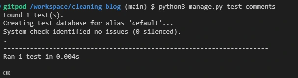

# Testing

[Return to README.md](README.md)

# Contents Table
- [Testing](#testing)
- [Contents Table](#contents-table)
  - [User Story and Features Testing](#user-story-and-features-testing)
  - [Automatic Testing](#automatic-testing)
  - [Accessibility Testing](#accessibility-testing)
    - [WAVE](#wave)
    - [Accessibility Insights for Web](#accessibility-insights-for-web)
  - [Performance Testing](#performance-testing)
    - [Lighthouse](#lighthouse)
  - [Code Validation](#code-validation)
    - [HTML](#html)
    - [CSS](#css)
    - [Python](#python)
    - [Javascript](#javascript)
  - [Bugs](#bugs)
    - [Unfixed Bugs](#unfixed-bugs)
    - [Fixed Bugs](#fixed-bugs)

## User Story and Features Testing

All completed user stories have been manually tested, including their corresponding features. Details of the test completed and the results can be seen below.

    
Epic: Project Set Up

    

        
User Story: Django Set Up

    

    

        
User Story: Early Deployment

    

    

        
User Story: PostgreSQL Database

    

 

    
Epic: Home Page

 

    
Epic: Blog Page

 

    
Epic: Comments Section

 

    
Epic: Authentication & Authorisation

 

    
Epic: Search Function

 

    
Epic: Project Submission

## Automatic Testing

I have used the local db.sqlite3 database for testing the views contained within the project. Please see the below regarding the results obtained:

    
Simple Views Tests

    At the start of the project I included initial tests for each of the views.py files contained in each app to ensure they were all configured correctly. Below is an example of the results obtained for the comments views designed to test for the presence of the HTTP Response "Hello World 3". 
    

 

    
Core Views Tests

 

    
Blog Views Tests

 

    
Comments Views Tests

 

    
Users Views Tests

## Accessibility Testing

### WAVE

### Accessibility Insights for Web

## Performance Testing

### Lighthouse

## Code Validation

### HTML

### CSS

### Python

### Javascript

## Bugs

### Unfixed Bugs

### Fixed Bugs

| **Bug** | **Fix** |
| -- | -- |
| Bug: | Solution: |