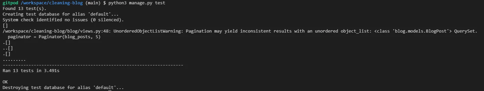
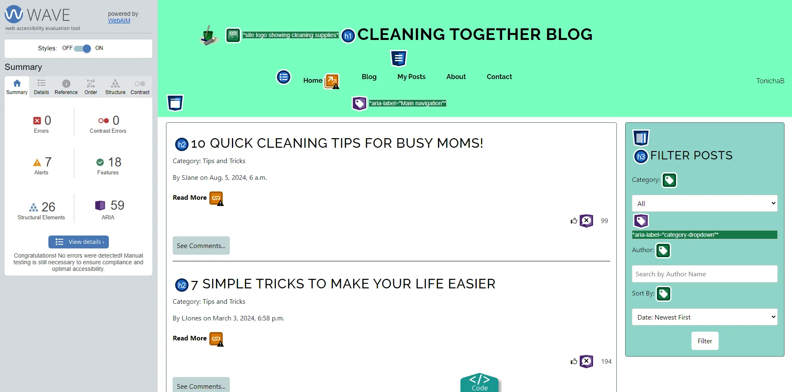
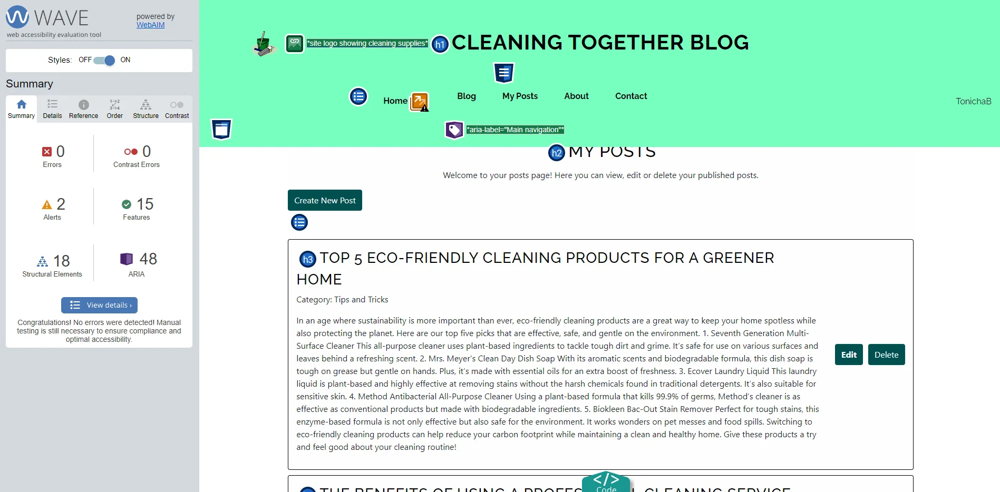
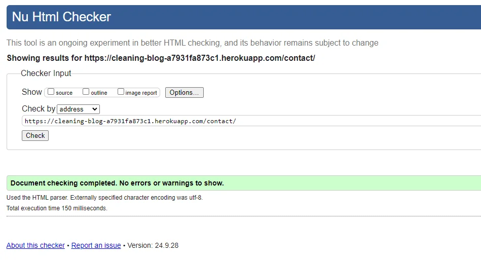

# Testing

[Return to README.md](README.md)

# Contents Table
- [Testing](#testing)
- [Contents Table](#contents-table)
  - [User Story and Features Testing](#user-story-and-features-testing)
  - [Automatic Testing](#automatic-testing)
  - [Accessibility Testing](#accessibility-testing)
    - [WAVE](#wave)
    - [Webaim Contrast Checker](#webaim-contrast-checker)
    - [Adobe Colour Accessibility](#adobe-colour-accessibility)
  - [Performance Testing](#performance-testing)
    - [Lighthouse](#lighthouse)
      - [Mobile View:](#mobile-view)
      - [Desktop View:](#desktop-view)
      - [Mobile View:](#mobile-view-1)
      - [Desktop View:](#desktop-view-1)
      - [Mobile View:](#mobile-view-2)
      - [Desktop View:](#desktop-view-2)
      - [Mobile View:](#mobile-view-3)
      - [Desktop View:](#desktop-view-3)
      - [Mobile View:](#mobile-view-4)
      - [Desktop View:](#desktop-view-4)
  - [Code Validation](#code-validation)
    - [HTML](#html)
      - [URL Input](#url-input)
      - [Direct Source Input](#direct-source-input)
      - [URL Input](#url-input-1)
      - [Direct Source Input](#direct-source-input-1)
      - [URL Input](#url-input-2)
      - [Direct Source Input](#direct-source-input-2)
      - [URL Input](#url-input-3)
      - [Direct Source Input](#direct-source-input-3)
      - [Direct Source Input](#direct-source-input-4)
    - [CSS](#css)
    - [Python](#python)
    - [Javascript](#javascript)
  - [Bugs](#bugs)

## User Story and Features Testing

The User Stories have been manually tested, including their corresponding features. Details of the test completed and the results can be seen below.

**Epic: Home Page**

| User Story | Test Action | Expected Result | Actual Result | Pass/Fail | Result Visual |
| -- | -- | -- | -- | -- | -- |
| [#11](https://github.com/TonichaB/cleaning-blog/issues/11) | Click on all navbar links for home, blog, about, and contact pages | User is redirected to the correct site page based on the link clicked | Redirection occurs as intended | Pass |  |
| [#12](https://github.com/TonichaB/cleaning-blog/issues/12) | Navigate to the site Home Page | Site introduction should be clearly presented and responsive  | Site introduction on the home page is clearly presented and responds as expected to changes in screen sizes  | Pass  |   |
| [#13](https://github.com/TonichaB/cleaning-blog/issues/13) | Click on the social media links in the footer | A new tab opens to reflect the correct social media platform relevant to the icon clicked | New tabs open and the correct platform website is shown | Pass |  |
| [#14](https://github.com/TonichaB/cleaning-blog/issues/14) | Before any posts have been added, scroll to view the popular posts section and refresh page | The Popular Posts section shows a message if no posts available | Popular post section correctly shows the correct message | Pass |  | 
| [#14](https://github.com/TonichaB/cleaning-blog/issues/14) | When blog posts have been created, scroll to view the popular posts section on the home page | The top 5 most popular posts, based on a 'likes' metric, are presented in order | Popular posts are displayed as expected | Pass |  |

**Epic: Blog Page**

| User Story | Test Action | Expected Result | Actual Result | Pass/Fail | Result Visual |
| -- | -- | -- | -- | -- | -- |
| [#18](https://github.com/TonichaB/cleaning-blog/issues/18) | Click the 'Blog' link on the home page | User is redirected to the blog page | Redirection to blog page occurs as expected | Pass |  |
| [#18](https://github.com/TonichaB/cleaning-blog/issues/18) | Click 'Create Post' button | New 'Create Post' modal opens with a form to be completed in order to publish the pist | Create Post modal appears as expected, with input fields for title and content required to publish a post | Pass |  |
| [#18](https://github.com/TonichaB/cleaning-blog/issues/18) | Click Publish button | Confirmation message to appear confirming post published and user redirected to blog page/my posts modal | Confirmation message appears as expected, and redirection occurs back to blog page/my posts modal where applicable | Pass |  |
| [#19](https://github.com/TonichaB/cleaning-blog/issues/19) | Click Like as an authorised User for an unliked post | Like icon changes to show as filled in, and like count increases by 1. | The icon changes as expected and the like count has increased by 1 | Pass |  |
| [#19](https://github.com/TonichaB/cleaning-blog/issues/19) | Click Like on a previously liked post | Like icon changes to the regular icon and the like count decreases by 1. | The like icon changes as expected and the like count has decreased by 1 | Pass |  |
| [#20](https://github.com/TonichaB/cleaning-blog/issues/20) | Click on My Posts in navbar | User is redirected to My Posts site page and list of user posts displayed | Page redirects as expected, and the correct list of posts applicable to the logged in user are present. | Pass |  |
| [#20](https://github.com/TonichaB/cleaning-blog/issues/20) | Click Edit button for a post entry | An edit post modal opens pre-populated with the content of the post ready to edit. | The modal appears as expected and the correct data for the relevant post has been prepopulated. | Pass |  |
| [#20](https://github.com/TonichaB/cleaning-blog/issues/20) | Close Edit Modal with no changes made. | Clicking on the 'x' within the edit modal, when no changes have been made, will close the modal. | After making no changes, the modal closes as expected when clicking 'x'. | Pass |  |
| [#20](https://github.com/TonichaB/cleaning-blog/issues/20) | Click to close Edit Modal with unsaved changes | An alert should appear to the user to notify them of the unsaved changes and will request their confirmation before closing. | Alert appears as expected and clearly states there are unsaved changes. | Pass |  |
| [#20](https://github.com/TonichaB/cleaning-blog/issues/20) | Click to confirm close with unsaved changes | The modal should close and unsaved changes will not update on the post | Clicking to confirm changes closes the model as expected. The post remains unchanged. | Pass |  |
| [#20](https://github.com/TonichaB/cleaning-blog/issues/20) | Click cancel on unsaved changes alert. | Clicking cancel will not close the modal to allow the user to save their changes | The modal does not close and editing can continue as expected | Pass |  |
| [#20](https://github.com/TonichaB/cleaning-blog/issues/20) | Click Save Changes Button | The edit modal should close and the edited content will have been updated in the my posts and blog pages. | The modal closes as expected, and the edits made to the post are sucessfully updated in the published post | Pass |  |
| [#20](https://github.com/TonichaB/cleaning-blog/issues/20) | Click Delete button for a post entry | An alert should appear asking the user to confirm they want to delete. | Alert appears as expected with the further option to confirm or cancel. | Pass |  |
| [#20](https://github.com/TonichaB/cleaning-blog/issues/20) | Click to confirm post deletion | The my posts page refreshes and the applicable post is no longer present. | The page refreshes as expected and the post has been successfully removed. | Pass |  |
| [#21](https://github.com/TonichaB/cleaning-blog/issues/21) | When logged into the site as an admin, navigate to the admin panel through the user dropdown | After clicking the user dropdown, and then clicking the admin option, the page should redirect to the admin panel. | Page is redirected as expected and admin panel appears. | Pass |  |
| [#21](https://github.com/TonichaB/cleaning-blog/issues/21) | Select a blog post via the admin panel, click and confirm to delete post. | In the admin panel, click Blog Posts to see a list of posts, and then click a post entry to open the edit options. Click and confirm to delete post, and a notification should appear to confirm deletion. | Clicking on a post correctly opens the editor with the delete option. Clicking delete gives a confirmation message, and confirming to delete removes the post with the correct notification appearing. | Pass |  |

**Epic: Comments Section**

| User Story | Test Action | Expected Result | Actual Result | Pass/Fail | Result Visual |
| -- | -- | -- | -- | -- | -- |
| [#22](https://github.com/TonichaB/cleaning-blog/issues/22) | Click Show Comments Button (Exising Comments Available) | Hidden comments section should appear to show the list of existing comments applicable to the post | The comments section appears as expected and shows the list of existing comments | Pass |  |
| [#22](https://github.com/TonichaB/cleaning-blog/issues/22) | Click Show Comments Button (No Comments Available) | Hidden comments section should appear with a message to confirm there are no current comments. | The comments section appears as expected and a paragraph confirms no existing comments and encourages the user to post the first comment. | Pass |  |
| [#22](https://github.com/TonichaB/cleaning-blog/issues/22) | Input comment text and click submit | Notification appears to confirm comment posted, and comments section updates to show the new comment | Notification appears as expected, and comments section has been correctly updated | Pass |  |
| [#26](https://github.com/TonichaB/cleaning-blog/issues/26) | Via the Django Admin page, select a comment and delete | Confirmation message to appear to confirm if deletion successful, and comment removed from site | Successful deletion message appears as expected, and comment no longer visible on the site | Pass |  |

**Epic: Authentication & Authorisation**

| User Story | Test Action | Expected Result | Actual Result | Pass/Fail | Result Visual |
| -- | -- | -- | -- | -- | -- |
| [#27](https://github.com/TonichaB/cleaning-blog/issues/27) | Click Register/Login link in header | Register modal opens with a registration form requiring a username, email password and password confirmation. | Register modal appears as expected with fully functioning form for user input. | Pass |  |
| [#27](https://github.com/TonichaB/cleaning-blog/issues/27) | Click Register after inputting valid details in form | Notification appears to confirm successfuly registration, and user is automatically logged in to their account. Register/login button is replaced with username dropdown link. | Notification appears as expected and the page refreshes to show the logged in username as a dropdown link replacing the register/login button. | Pass |  |
| [#27](https://github.com/TonichaB/cleaning-blog/issues/27) | Click Register with non-matching passwords input | Notification to appear advising the passwords do not match and account not registered. Register modal remains to allow the user to amend and resubmit. | Notification appears as expected and modal remains to allow user to change details | Pass |  |
| [#27](https://github.com/TonichaB/cleaning-blog/issues/27) | Click Register with existing details input | Notification to appear advising account already exists and modal remains open to allow user to try again. | Notification appears as expected and modal does not close. | Pass |  |
| [#27](https://github.com/TonichaB/cleaning-blog/issues/27) | Click 'X' in Register modal | Register modal is closed | Modal closes as expected | Pass |  |
| [#28](https://github.com/TonichaB/cleaning-blog/issues/28) | Click login link within register modal | Login Modal appears with form for user login | The login modal appears and replaces the register modal. Login form displays as expected. | Pass |  |
| [#28](https://github.com/TonichaB/cleaning-blog/issues/28) | Click to login using valid details | Using a valid username and password a successful login message appears and register/login button is replaced with the user's username | Confirmation message appears as expected, and register/login link is replaced with the correct username | Pass |  |
| [#28](https://github.com/TonichaB/cleaning-blog/issues/28) | Click to login using invalid details | Message to appear to notify user of invalid details entered | Message appears as expected to notify of invalid login details | Pass |  |
| [#28](https://github.com/TonichaB/cleaning-blog/issues/28) | Click 'X' in Login modal | Login modal is closed | Modal closes as expected | Pass |  |
| [#29](https://github.com/TonichaB/cleaning-blog/issues/29) | Click on username in header | Dropdown should appear and logout link is displayed | Dropdown works as intended and logout link is displayed | Pass |  |
| [#29](https://github.com/TonichaB/cleaning-blog/issues/29) | Click on logout link | Message to appear to confirm logout request, user can confirm or cancel | Message appears as expected with a button to confirm or cancel | Pass |  |
| [#29](https://github.com/TonichaB/cleaning-blog/issues/29) | Click to confirm logout | Message appears to confirm logout successful, and user redirected to home page with register/login buttons presented | Message confirmation appears as expected and page redirects to home page with button to register/login present | Pass |  |
| [#30](https://github.com/TonichaB/cleaning-blog/issues/30) | Click to like a post when not logged in | Notification should appear to advise user to register/login in order to like posts, and the login modal should open. | Notification appears as expected, advising only logged in users can like a post, and login modal opens automatically. | Pass | |
| [#30](https://github.com/TonichaB/cleaning-blog/issues/30) | Click to comment on a post when not logged in | Notification should appear to advise user to register/login in order to comment on a post, and login modal opens | Notification and login model appear as expected | Pass |  |
 

[Back to Top](#contents-table)

## Automatic Testing

I have used the local db.sqlite3 database for testing the views contained within the project. Please see the below regarding the results obtained: 

At the start of the project I included initial tests for each of the views.py files contained in each app to ensure they were all configured correctly. Below is an example of the results obtained for the comments views designed to test for the presence of the HTTP Response "Hello World 3".

    
Initial Views Tests

    

 

At the end of the project, the tests for each app had been updated, so an overall test was completed which returned successfuly results.

  
Final Views Tests

  

 

The individual test results were broken down as follows:

  
Blog Views Tests

  
      

  
Comments Views Tests

  
      

  
Users Views Tests

  
      

  
Core Views Tests

  
      

 

I have also completed a coverage report to see the tests coverage for the project. Overall the results show 82% of the codebase has been covered by the currently implemented tests, in future interations for the site development I would aim to achieve 100%.

  
Coverage Report

  

 

[Back to Top](#contents-table)

## Accessibility Testing

### WAVE

I have used the WAVE Chromer Extension to test the accessibility for each site page. The results have confirmed 

  
Home Page

  

  
Blog Page

  

  
My Posts Page

  

  
About Page

  

  
Contact Page

  

### Webaim Contrast Checker

Alongside the WAVE feature, I have completed specified checks for the colour contrasts throughout the project. To do so I have used the Webaim contrast checker and the results are shown below. In some cases, the Hex values shows in the results will vary from the codebase due to the codebase using transparency values. I therefore used an eyedropper tool to get the hex value for the presenting colour in order to complete the tests (applicable tests have been marked * for reference) 

  
*Popular Posts Section

  

  
Header Text and Background

  

  
Footer Text and Background

  
  

  
*See Comments Button

  
  

  
*Filter Posts Text and Background

  
  

  
Text Links and Background

  
  

  
My Posts Buttons and User Notifications

  
  

  
Social Media Links and Footer Background

  
  

### Adobe Colour Accessibility

Using the Adobe Colour page I have tested my colour scheme for the project to ensure the colours used are suitable for any users with colour blindness. 

 

[Back to Top](#contents-table)

## Performance Testing

### Lighthouse

Using the Lighthouse feature contained in the Google Dev Tools extension I was able to test the performance for each page of the site both on desktop and mobile views. The overall results are very positive, however improvements could be made in future iterrations to increase the performance score for the mobile views. The results can be seen below: 

  
Home Page Results

  #### Mobile View:
  

  #### Desktop View:
  

  
Blog Page Results

  #### Mobile View:
  

  #### Desktop View:
  

  
My Posts Page Results

  #### Mobile View:
  

  #### Desktop View:
  

  
About Page Results

  #### Mobile View:
  

  #### Desktop View:
  

  
Contact Page Results

  #### Mobile View:
  

  #### Desktop View:
  

 

[Back to Top](#contents-table)

## Code Validation

### HTML

I have completed thorough testing to validate the HTML used in the project by checking using the url input where possible, and also validating the direct source input. All results have passed and can be seen below: 

  
Home Page

  #### URL Input

  

  #### Direct Source Input

  

  
Blog Page

  #### URL Input

  

  #### Direct Source Input

  

  
About Page

  #### URL Input

  

  #### Direct Source Input

  

  
Contact Page

  #### URL Input

  

  #### Direct Source Input

  

  
My Posts Page

  #### Direct Source Input

  

### CSS

The CSS for the project has also been tested by validating the direct input of the full css file, validating the url input for each of the main site pages, and testing the direct input for the My Posts Page. The results have passed with no errors and are shown below: 

  
"style.css" File Validation

  

  
Home URL Input

  

  
Blog Page URL Input

  

  
About Page URL Input

  

  
Contact Page URL Input

  

  
My Posts Page Direct Source Input

  

### Python

Each App contained in the project has utilised python files that have each been validated using the [Code Institute CI Python Linter](https://pep8ci.herokuapp.com/). Please see the below for the results obtained for each app. 

  
Blog App

  - 

      
admin.py

      
      
      

  - 

      
models.py

      
      
      

  - 

      
tests.py

      
      
      

  - 

      
views.py

      
      
      

    

  
Comments App

  - 

      
admin.py

      
      
      

  - 

      
models.py

      
      
      

  - 

      
tests.py

      
      
      

  - 

      
views.py

      
      
      

  

  
Users App

  - 

      
apps.py

      
      
      

  - 

      
test.py

      
      
      

  - 

      
views.py

      
      
      

  

  
Core App

  - 

      
tests.py

      
      
      

  - 

      
views.py

      
      
      

  

 

In the project directory there is a global urls.py file containing the required url pathways for the site.

  
urls.py

  

### Javascript

I have validated the Javascript code using the online JSHint validator. The results have passed with no errors and are shown below: 

  
JSHint Results

  

 

[Back to Top](#contents-table)

## Bugs

At the time of final deployment, there were no known bugs to be fixed.

| **Bug** | **Fix** | **Status** |
| -- | -- | -- |
| Register/Login Modal not displayed when clicking on the links in the header | Correct the CSS styling for the modal and modal content classes. | Bug Fixed |
| 403 Forbidden Error- Get Popular Posts | Correct the url details within the JavaScript to correctly match the url pattern. | Bug Fixed |
| 403 Forbidden Error- CSRF cookie not set | Correct typo errors within fetch requests, include CSRF verification in HTML, configure settings to include trusted CSRF origins | Bug Fixed |
| Username link dropdown not displaying correctly. Logout link displays below username rather than inside the dropdown | Add JavaScript to deal with the dropdown function and update css styling for better positioning | Bug Fixed |
| After logging out, user is not redirected to the home page | Amend the urlpatterns for the root url path to connect to the core homepage. | Bug Fixed |
| Notifications do not appear when function called on | Correct the styling and using console.logs isolated the issue with the javascript functions calling the notification function incorrectly.  | Bug Fixed |
